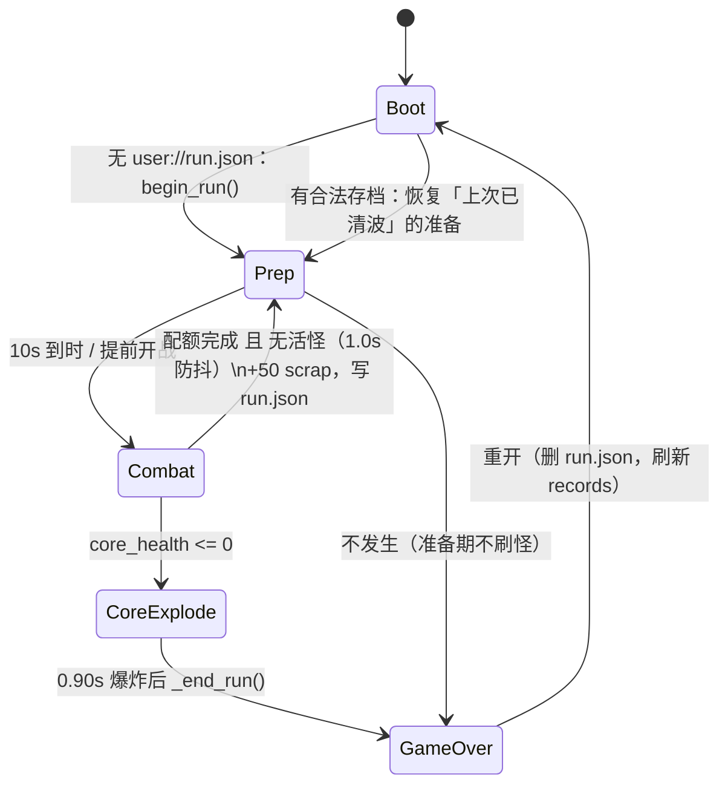
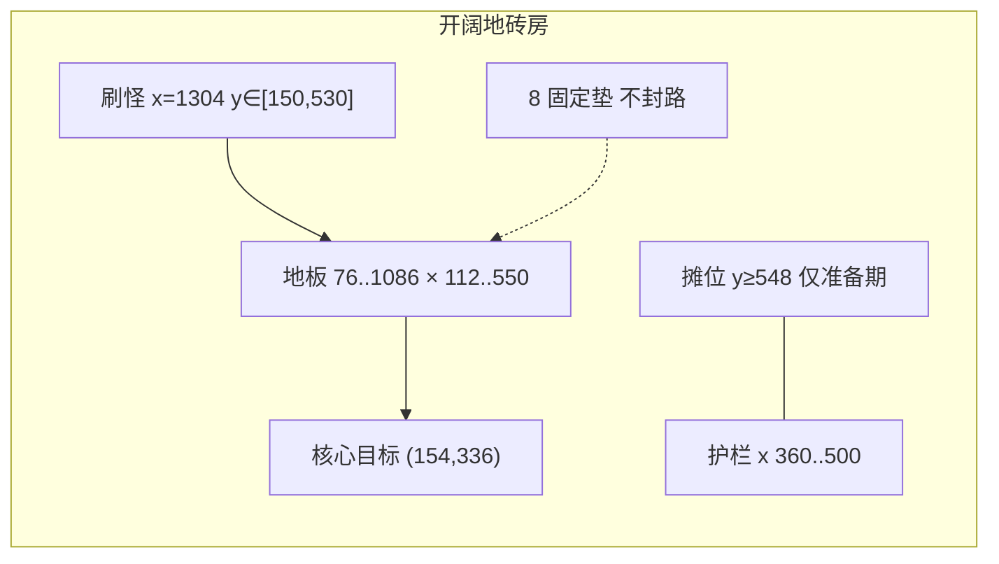
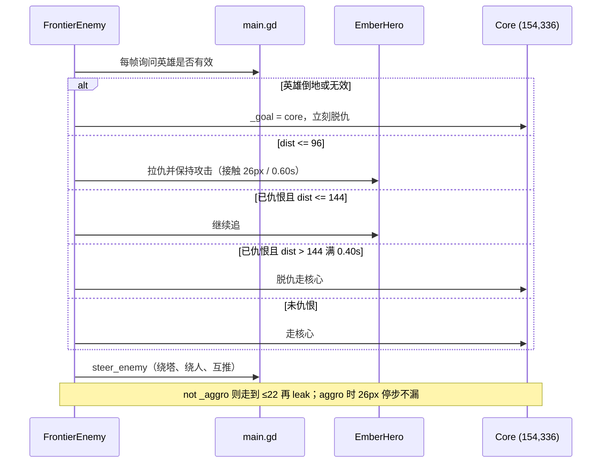
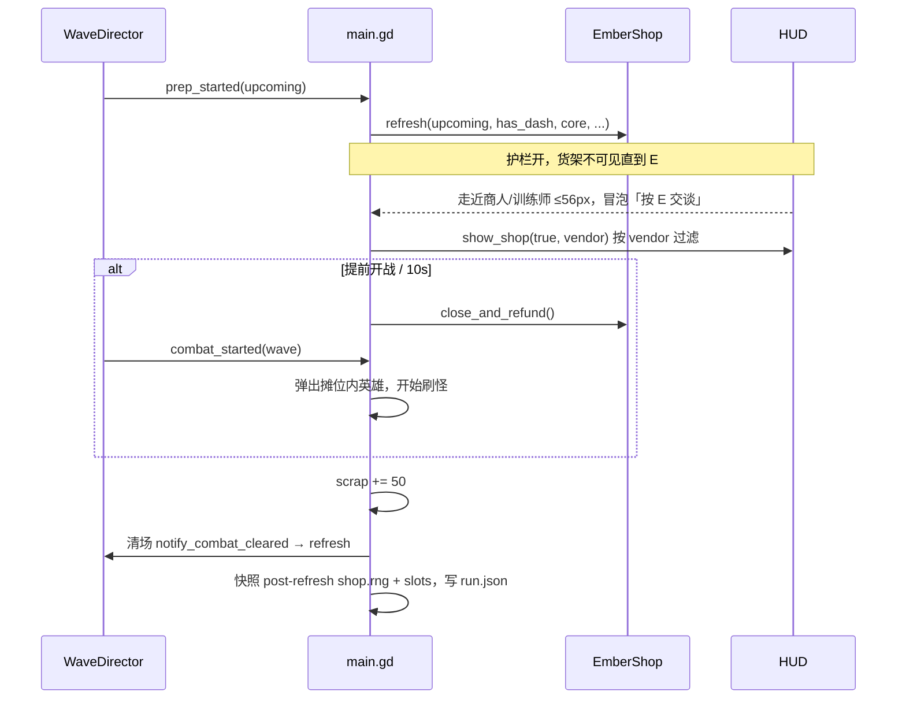

# 余烬防线 · 核心规则与单局流程 v1.0

| 字段 | 值 |
|---|---|
| 作者 | 余烬防线设计 |
| 日期 | 2026-08-20 |
| 状态 | Draft |
| 引擎 | Godot 4.7（`project.godot` `config/features`） |
| 场景 | 现有 `res://main.tscn`（不换图、不新开战场） |
| 读者 | 要在现图上把第 1–10 波做成可玩闭环的工程师 |

本文钉死**可玩闭环**：仇恨 / 路径 / 漏怪、波次机、8 垫建造、伤害与经济、存档、性能上限。所有战斗数字来自当前代码；相对现状的改动标 **CHANGE**，沿用标 **KEEP**。

**不是** 19 章内容愿景。下列全部冻结，本 spec 不设计、不排期：第 4 种武器 / 第 4 种塔、融合、雇佣兵、多地图、Boon / 天赋、6 名新 NPC。已有内容清单仍以 `docs/soul-knight-endless-td-design.md` 与 `docs/superpowers/specs/2026-08-17-endless-soul-knight-td-design.md` 为准，但其中与本文冲突的条目（全图追英雄、自由格子建造、冲刺绑 `K`、小兵 `7+n*2`）以本文为准。

---

## Overview

当前局已经能在开阔地砖房里开准备、刷怪、摆塔、换枪、倒地复活、核心归零结算。缺口是规则不闭合：`enemy_target_position()` 对活着的英雄**永远返回英雄坐标**（全图追人），塔位是 `CELL_SIZE=48` 的自由格子而不是 8 个固定垫，没有出售，没有 `user://run.json`，活怪 / 子弹没有硬顶。玩家无法用「垫位 + 近身抗怪」做决策，工程师也无法按一张表打完 1–10 波。

本 spec 把单局锁成：100 秒准备 → 作战 → 配额清完且场上无活怪 → +50 废料进入下一准备。核心一侧刷家门奖励；摊位地上摆货架。敌人默认走向核心 `Vector2(CORE_HIT_X, LANE_Y)=(154, 336)`；**只有**欧氏距离 ≤ 96px 才拉仇（没有单独的挡路规则），144px 外墙钟 0.4s 脱仇。仇恨中即使贴着核心也不漏。建造容量 = 8 个固定垫，售出返还 `build_cost(kind)` 的 60%。局内成长全部重置；只在核心 HP 归零时写入最高波 / 击杀 / 存活时间；只在清波时写 `user://run.json`。第 1–10 波的数量、间隔、配比、赏金、货架价全部按现公式算出，文中不留 TBD。

---

## Background & Motivation

### 当前能跑的闭环

- `WaveDirector`（`scripts/wave_director.gd`）：`begin_run()` → `PREP` 10s → `start_wave()` / 倒计时结束 → `COMBAT` → `notify_combat_cleared()` 再准备。
- `main.gd` `_on_combat_started`：`_spawn_remaining = 4 + current_wave * 2`（W1=6），间隔 `max(0.40, 0.90 - wave * 0.04)`，第 1 波只有侦察/跑者。每 5 波在普通配额后再 `_spawn_boss()`。
- 英雄：开局剑、100 血、无冲刺；倒地 4.0s，在 `revive_position=(CORE_HIT_X+80, LANE_Y)=(234, 336)` 以 40 血、0.40s 受伤无敌复活。
- 商店：准备期护栏开，走近商人 / 训练师按 `E` 交谈才出货架。第 1 波货架写死。
- 三种塔 `pulse` / `burst` / `frost`，武器 `sword` / `pistol` / `shotgun`（+ `pistol_plus` / `shotgun_plus` 掉落）。

### 痛点

1. **全图追人**。`main.gd` `enemy_target_position()` 在英雄未倒地时无条件返回 `_hero.global_position`。`tests/smoke_test.gd` 甚至断言「活着的英雄就是追击目标」。开阔房变成死亡竞赛，塔的锁路价值接近零。
2. **建造无容量**。`_try_place_tower` 按格子占 `_occupied_spots`，`BUILD_MIN/MAX` 内任意空格都可建。与 08-17 spec「8 个固定塔位」和本产品锁定的「8 垫 = 唯一容量」不一致。
3. **不能卖塔**。选中后只能 `U` 升级，填错种类只能硬吃到核心破。
4. **崩溃即重开**。没有 `user://run.json`。战斗中闪退等于整局作废。
5. **没有活怪 / 子弹顶**。第 10 波配额 39+Boss=40，再往后公式继续涨；当前 `spawn_projectile` / `spawn_hero_projectile` 直接 `add_child` + `queue_free`，无池。

### 本文解决什么

在**现图**上把 1–10 波变成可测、可复现的玩法闭环，让工程师按函数名改、按表验收，不必发明数字。

---

## Goals & Non-Goals

### Goals

- 第 1–10 波在 `res://main.tscn` 上可玩、可无头烟测。
- 仇恨从「追英雄」改为「走核心 + 96px 圆拉仇 + 144px 脱仇」；贴核心肉抗不漏。
- 8 垫硬顶、可卖（60% 造价）、可在作战中填空垫和升级。
- 伤害公式、刷怪公式、物价公式与当前 `main.gd` / `tower.gd` / `shop.gd` / `weapon_catalog.gd` 一致（除本文标明的 CHANGE）。
- 清波自动存档；战斗中途不存；核心归零才结束并刷新记录。
- 活怪 ≤ 40、子弹 ≤ 120、塔 ≤ 8。

### Non-Goals（冻结）

- 新武器 ID、新塔 ID、新 NPC、新地图、墙、可封闭路径。
- 暴击、护甲、元素、Boon、天赋、人口 / 电力。
- 第 11 波及以后的突变、词缀、软帽。Wave 11+ **KEEP** 现公式，不在本 PR 计划里做平衡。
- 把 `main.gd` 拆成 Autoload / `actors/` / `waves/` 目录（那是 `docs/soul-knight-endless-td-design.md` 的长期结构，不是本闭环）。
- 联机、手柄重绑、中文以外的文案系统。
- 把 Tab 2× 扩展到敌人移动 / 塔 CD / 弹道 / 仇恨计时（KEEP 现状：只乘刷怪间隔和清波 1.0s 防抖）。

---

## Proposed Design

### 1. 单局状态机（KEEP 结构，补存档边）



相位由 `WaveDirector.phase` 持有：`PREP` / `COMBAT`。`main._is_game_over` 是第三态。

| 相位 | 护栏 `is_shop_gate_open()` | 商店买入 | 建造 | 升级 | 出售 |
|---|---|---|---|---|---|
| 准备 | 开 | 走近 NPC 按 `E` 后可买 | 空垫可放持塔或付费默认种 | 可 | 可 |
| 作战 | 关，英雄被 `_eject_hero_from_shop` | 关；`close_and_refund()` 退未放置持塔 | 空垫可付费放 `default_tower_kind`（**未缩放** `build_cost`） | 可 | 可 |
| 结束 | 关 | 关 | 忽略点击 | 忽略 | 忽略 |

清波判定 **KEEP** `main.gd` `_process`：

```
_spawn_remaining == 0 and (not _needs_boss() or _boss_spawned) and _enemies.is_empty()
```

然后 `_wave_clear_timer >= 1.0` 才 `_finish_wave()`（**KEEP** 1.0s 防抖，避免最后一击与清场同帧把 HUD 冲掉）。漏怪走 `_reach_base()`，**不**阻止清波。

`_finish_wave()` 写档顺序 **CHANGE**（必须按号；`shop.rng` 在 refresh **之后**拍）：

1. `scrap += 50`（KEEP）。
2. `_director.notify_combat_cleared()` → `begin_prep()` → `prep_started` → `_refresh_shop_stock(upcoming_wave)`。
3. **快照** `_drop_rng.state`、`_shop.rng.state`（**refresh 之后**）以及 `_shop.slots` 副本。
4. 写 `user://run.json`。完整字段映射见 §11。

提前开战：**KEEP** HUD「提前开战」→ `start_wave()` → `WaveDirector.start_wave()`。

倍速 **KEEP 现状、本批不扩大**：`simulation_speed`（Tab / HUD）**只**乘 `_process_spawning` 的 `delta` 和 `_wave_clear_timer`。敌人、塔、弹道、英雄、接触伤害、仇恨 / 脱仇计时全部走未缩放的 `_process(delta)`。准备倒计时不加速。因此 2× 时 KEEP 的 1.0s 清波防抖是 **0.5s 墙钟**。08-17 / README 写「2× 加速敌人移动」是文档错误，**不要**在 PR1 里「补完」。

### 2. 战场几何（KEEP 坐标，CHANGE 建造域）

现图是开阔房，不是封闭车道。`get_route_contract()` **KEEP**：

| 常量 | 值 | 含义 |
|---|---|---|
| `VIEW_SIZE` | `(1280, 720)` | 视口 |
| `LANE_Y` | `336` | 核心高度 / 英雄默认线 |
| `SPAWN_X` | `1304` | 右画外刷新 |
| `SPAWN_Y_MIN/MAX` | `150 / 530` | `_random_spawn_point` 纵轴 |
| `CORE_HIT_X` | `154` | 敌人目标 X / 漏怪判定点 X |
| `BASE_X` | `90` | 核心精灵 |
| `FLOOR_BOUNDS` | `Rect2(76, 112, 1010, 438)` | 英雄可走地板 |
| `CELL_SIZE` | `48` | 仅用于垫点对齐，不再自由铺格 |
| `SHOP_BOTTOM` | `Rect2(168, 548, 520, 96)` | 准备期护栏内摊位 |
| `GATE_X_MIN/MAX` | `360 / 500` | 护栏口 |

敌人目标点：**KEEP** `Vector2(CORE_HIT_X, LANE_Y) = (154, 336)`。漏怪半径 22px KEEP，但停步与谓词见 §3.2（**CHANGE**：未仇恨必须能走进 22px 并漏，不能停在 26px）。



### 3. 仇恨 / 路径 / 漏怪（CHANGE 仇恨与漏怪谓词，KEEP 绕行）

#### 3.1 现状

```920:923:scripts/main.gd
func enemy_target_position(_from: Vector2) -> Vector2:
	if _hero != null and is_instance_valid(_hero) and not _hero.is_down:
		return _hero.global_position
	return Vector2(CORE_HIT_X, LANE_Y)
```

`FrontierEnemy._follow_seek` 每帧用这个结果覆盖 `_goal`。英雄活着 = 全图追。

#### 3.2 新规则（CHANGE）

常量（写在 `enemy.gd`，`main` 不要复制第二份）：

| 名 | 值 | 备注 |
|---|---|---|
| `AGGRO_RADIUS` | `96.0` | 拉仇的**全部**规则：欧氏圆。没有挡路 / 走廊分支 |
| `LEASH_RADIUS` | `144.0` | 已仇恨时继续追的半径 |
| `LEASH_DROP` | `0.40` | 离开 144px 后脱仇的**墙钟**秒数 |

每个 `FrontierEnemy` 增加：

```gdscript
var _aggro := false
var _leash_away := 0.0  # 离开 144px 后的累计墙钟；不是 remaining countdown
```

`_update_aggro(delta, hero_pos, hero_down)` 必须吃 **原始 `_process` 的 `delta`**，禁止传入 `travel_distance / move_speed`，禁止乘 `_slow_factor`，禁止乘 `simulation_speed`。霜钉与 Tab 2× **都不**拉长 0.40s。

每帧（`_process` 里先 `_update_aggro(delta, …)`，再 `_follow_seek`）：

1. 英雄无效或 `is_down`：**立刻** `_aggro = false`，`_leash_away = 0`，`_goal = _core_goal`。全场倒地 = 全场去核心。
2. `dist = global_position.distance_to(hero.global_position)`。
3. **拉仇**（英雄活着）当且仅当 `dist <= 96`：`_aggro = true`，`_leash_away = 0`，`_goal = hero.global_position`。96px 圆就是全部拉仇机械，**不**再写挡路函数。
4. 已仇恨且 `dist <= 144`：保持仇恨，追英雄，`_leash_away = 0`。96–144 之间继续追，方便风筝。
5. 已仇恨且 `dist > 144`：`_leash_away += delta`（墙钟累计）。`_leash_away >= 0.40` 后脱仇，`_aggro = false`，`_goal = _core_goal`。0.40s 内回到 144 则 `_leash_away = 0` 并继续追。
6. 未仇恨：`_goal = _core_goal`。

不要实现 `_hero_blocks_approach`。任何「投影在敌人→核心线段上即可拉仇」都会从 `SPAWN_X=1304` 点名整条车道，等于退回全图追。

`main.enemy_target_position` **CHANGE** 签名，查询**该敌人当前 `_goal`**，不再是全局英雄坐标：

```gdscript
func enemy_target_position(_from: Vector2, enemy: Node = null) -> Vector2:
	if enemy is FrontierEnemy and is_instance_valid(enemy):
		return enemy.get("_goal") as Vector2
	return Vector2(CORE_HIT_X, LANE_Y)
```

无 `enemy` 参数时**永远返回核心**。烟测禁止用无 enemy 的调用来断言仇恨——那种调用即使用旧代码也会在「改成返回核心」后假绿。PR1 断言必须持有活的 `FrontierEnemy`（见 Observability）。

状态机放在 `enemy.gd`。`main` 提供 `hero_seek_position() -> Vector2`（倒地返回 `Vector2.INF`）和 `core_goal() -> Vector2`。`_follow_seek` 不再每帧用 `enemy_target_position(global_position)` 覆盖 `_goal`。

漏怪 + 停步 **CHANGE**（相对现状 `to_goal > 26` 才迈步、以及 `<=22 且 _goal 距核心 ≤8` 才漏）：

现状 `_follow_seek`（`enemy.gd` 105–113）只在 `to_goal.length() > 26.0` 时给方向，否则原地停。若漏怪阈值仍是 22px，未仇恨走核心会停在 `(22, 26]` 死区，Boss/重装迈步 <1px/帧跳不过 4px，**核心永不扣血**。必须拆开：

```gdscript
# 每帧：先漏，再决定是否迈步。22px 半径 KEEP。
if (not _aggro) and global_position.distance_to(_core_goal) <= 22.0:
	_reach_base()
	return
var to_goal := _goal - global_position
var hold := 26.0 if _aggro else 22.0  # 26px 停步只对仇恨：躲开英雄接触圈
var direction := Vector2.ZERO
if to_goal.length() > hold:
	direction = to_goal.normalized()
# 然后 KEEP steer_enemy …
```

- **未仇恨**：一直走到 ≤22px 再 `_reach_base()`。这是唯一失败条件能触发的路径。
- **已仇恨**：在英雄 26px 接触圈外停步（与 `_process_hero_contact` 的 26px 对齐），即使英雄站在水晶上也不漏。
- 禁止再用 `_goal.distance_to(_core_goal) <= 8.0`。

倒地后 `_aggro` 清掉，才会走进 22px 撞核。

`_on_enemy_reached_base` **KEEP**：`core_health -= enemy.core_damage`（至少 0），`core_health <= 0` → `_explode_core()`。漏一只算一只，不暂停刷怪、不清波否决。

#### 3.3 绕行（KEEP）

`steer_enemy` **KEEP**：塔 52px 推开、同族分离（boss 42 / brute 32 / mage 28 / runner 24 / scout 26）、英雄 28px 推开。塔**不是**墙，本 spec **不**加阻挡体。8 垫间距多数 ≥ 144px（东南垫到南排约 107px），配合 52px 绕行，无法封死去核心的路。

垫 7 `(888, 360)` 距 `LANE_Y=336` 只有 24px，是为保留现有作战烟测点击 `(900, 380)` 的**车道上妥协**：`steer_enemy` 会让中路流绕开这座塔。把它当绕行障碍，不当墙，不要为「中路绝对空」挪走它。

路径不可封闭是硬规则：任何「塔挡路」都只是绕行代价，不是封路。



### 4. 英雄开局与操作（KEEP）

| 项 | 值 | 代码 |
|---|---|---|
| 废料 | 300 | `main.scrap` |
| 核心 | 10 / 10 | `CORE_MAX`、`core_health` |
| 英雄生命 | 100 / 100 | `EmberHero.max_health/health` |
| 武器 | `sword` | `current_weapon` |
| 冲刺 | 未解锁 | `has_dash=false` |
| 出生 | `(640, 336)` | `_build_hero_slot` |
| 复活 | `(234, 336)`，血 40，受伤无敌 0.40s，倒地 4.0s | `revive_position`、`_update_down` |
| 移速 | 165 | `MOVE_SPEED` |
| 冲刺 | 解锁后：0.22s 位移 120px、无敌 0.30s、CD 6.0 / 4.5 / 3.5 | `_update_dash`、`DASH_COOLDOWNS` |
| 近战 | 46 + 8 × `attack_bonus_level`（0–3 → 46/54/62/70） | `apply_attack_upgrade` |
| 体魄 | 每级 +20 上限并立刻补 20，最多 3 | `apply_vitality_upgrade` |

操作 **KEEP** 现状（08-17 文档里「`K`=冲刺」作废）：

| 键 | 行为 |
|---|---|
| `WASD` / 方向键 | 八向走，夹在地板（准备期可进摊位） |
| `J` | 当前武器攻击 |
| `K` | 短跳 |
| `Space` | 冲刺（未解锁则 no-op） |
| `E` | 准备期、距 NPC ≤ `TALK_RADIUS=56` 时交谈 |
| `U` | 升级选中塔 |
| `Tab` | 1× / 2×（只加速刷怪间隔和清波防抖，见 §1） |
| 左键战场 | 空垫建造 / 选中已放塔 |

倒地 **KEEP**：不能移动、攻击、冲刺、拾取。塔继续开火。**局不结束**。只有 `core_health==0` 结束。倒地时全场脱仇（见 §3）。

接触伤害 **KEEP**：`CONTACT_INTERVAL=0.60`，距离 ≤ 26px，打 `enemy.contact_damage`（scout 8 / runner 6 / brute 16 / mage 10 / boss 28），然后英雄 `take_damage` 自带 0.40s `_hit_invuln`。

### 5. 建造：8 垫是唯一容量（CHANGE）

现状：任意 `BUILD_MIN=(268,140)`–`BUILD_MAX=(1188,548)` 内格子都可建。烟测点击 `(990,205)` / `(820,205)` / `(650,205)` / `(900,380)`。

**CHANGE**：删除自由铺格。容量 = 下面 8 个世界坐标。点击落到距垫心 ≤ 28px（与现 `_tower_at` 半径一致）才算打中该垫。打不中任何垫 → 「这里不能建造」。

现状 `_unhandled_input` 只在 `event.position.y > 200 and y < 580` 时进 `_handle_field_click`（`main.gd` 742–744）。北排垫 y=216，28px 半径上沿到 188，顶部约 16px 永远点不到。PR2 **CHANGE** 把过滤改成 `y > 180 and y < 580`，让 28px 命中为真；y≤180 仍归 HUD。

```gdscript
const TOWER_PADS: Array[Vector2] = [
	Vector2(456.0, 216.0),  # N-back
	Vector2(648.0, 216.0),  # 烟测 (650, 205)
	Vector2(840.0, 216.0),  # 烟测 (820, 205)
	Vector2(984.0, 216.0),  # 烟测 (990, 205)
	Vector2(456.0, 456.0),  # S-back
	Vector2(648.0, 456.0),
	Vector2(840.0, 456.0),
	Vector2(888.0, 360.0),  # 烟测作战放置 (900, 380)
]
```

北排 y=216 在车道 336 上方 120px，南排 y=456 在下方 120px。垫 7 `(888, 360)` 在车道上（距 336 仅 24px），是现烟测 `(900, 380)` 的格子中心，绕行代价可接受，见 §3.3。用 `pad_index 0..7` 替换 `_occupied_spots[cell]`。始终画出 8 个垫标记（空垫淡框，持塔时高亮）。

放置规则（准备 + 作战都有效）：

1. 点到已占垫：选中，HUD 出升级 / **出售**。
2. 点到空垫且 `held_kind != ""`：放下商店塔，`mark_tower_placed()`，不另扣费。
3. 点到空垫且未持塔：扣 **未缩放** `EmberTower.build_cost(default_tower_kind)`（pulse 80 / burst 110 / frost 90）。废料不足则提示。作战中这条仍然有效。
4. 8 垫全满：不能放；持塔可买但放不下，准备结束 / 开战时 `close_and_refund()` 全额退。提示「没有空余建造位」。
5. **不能搬塔**。没有移动 API。

默认塔种 **KEEP** `_cycle_default_tower`：pulse → burst → frost → pulse。

升级 **KEEP** T1→T3，费用来自 `get_upgrade_cost()`，作战中可升。花费的升级费**不**进入出售返还。

出售 **CHANGE**（现状无出售）：

```gdscript
func sell_refund(kind: StringName) -> int:
	return int(floor(float(EmberTower.build_cost(kind)) * 0.60))
# pulse 48 / burst 66 / frost 54，与等级无关
```

选中后按 HUD「出售」按钮（**无热键**，不绑 `X` / `S`）：`scrap += sell_refund(kind)`，从 `_towers` 移除，垫变空。T3 脉冲仍只退 48。不退升级费是刻意的，防止把垫当升级银行。

塔面板 **KEEP** `_tower_panel_left = 3.0` 秒后自动隐藏；隐藏后再卖必须再点一次垫。`set_tower_info` 签名扩展见 API。出售按钮放在「升级 U」下面，面板略加高，不挤掉默认塔种按钮。

### 6. 伤害（KEEP 现入口，不另做 min-1）

无暴击、无护甲、无元素。减速不改伤害。

结算入口 **KEEP** `FrontierEnemy.take_damage`：`safe_amount := maxi(amount, 0)`，**没有** `max(1, floor(base))`。溅射 **KEEP** `apply_splash`：`int(floor(float(damage) * splash_ratio))`，理论上可以为 0（T1 爆裂 16×0.55=8，现行三种塔打不出 0，不必为此 CHANGE）。英雄弹衰减 **KEEP**：飞过 `falloff_range` 后改用 `falloff_damage`。本 spec 不把伤害地板改成 1。

霜钉 **KEEP**：`spawn_projectile(..., &"frost")` → `set_frost(0.6, 1.5)` → `apply_slow`。非 Boss `_slow_factor = 0.6`（移速 ×0.6，即 40% 减速）；Boss **KEEP** 现实现，忽略传入因子，`applied = 0.80`。重复命中刷新时长（`_slow_left = maxf(_slow_left, duration)`），不叠乘。

塔数值 **KEEP** `tower.gd` `_apply_level_stats`：

| 种 | T1 伤/程/CD | T2 | T3 | 造价 | 升级 |
|---|---|---|---|---|---|
| pulse | 24 / 205 / 0.72 | 38 / 230 / 0.58 | 58 / 255 / 0.46 | 80 | 110 / 180 |
| burst | 16 / 190 / 0.90 + 溅射 78px×55% | 24 / 210 / 0.76 | 36 / 230 / 0.64 | 110 | 140 / 210 |
| frost | 10 / 200 / 0.80 + 减速 | 14 / 220 / 0.68 | 20 / 240 / 0.56 | 90 | 120 / 190 |

武器 **KEEP** `WeaponCatalog.get_def`：

| id | 伤 | CD | 备注 |
|---|---|---|---|
| sword | 46（再加锐击） | 连击窗，近战半径 118 | `J` 两刀 |
| pistol | 18 | 0.28 | 弹速 700，射程 420 |
| shotgun | 12 × 5 弹 | 0.70 | 散布 18°，180 后衰减到 6，240 消失 |
| pistol_plus | 23 | 同手枪 | Boss 掉落 |
| shotgun_plus | 15 / 衰减 8 | 同霰弹 | Boss 掉落 |

禁止发明新 ID。

### 7. 波次机与刷怪（KEEP 公式，公布表）

`_on_combat_started` **KEEP**：

```
_spawn_remaining = 9 + current_wave * 3
_spawn_timer = 0.1          # 第一只
之后每只：max(0.28, 0.68 - wave * 0.045)
_needs_boss := wave > 0 and wave % 5 == 0
```

`_pick_spawn_variant` **KEEP**（优先级：mage > brute(wave≥2) > runner > scout）：

```gdscript
func _pick_spawn_variant() -> StringName:
	var slot := _spawned_in_wave
	if slot % 5 == 4:
		return &"mage"
	if current_wave >= 2 and slot % 4 == 3:
		return &"brute"
	if slot % 3 == 1:
		return &"runner"
	return &"scout"
```

`_spawn_enemy` / `_spawn_boss` 生命 / 移速 / 赏金 / 接触 / 核心伤害 **KEEP** 现 match 臂。生成用 `configure_seek(_random_spawn_point(), Vector2(CORE_HIT_X, LANE_Y), self)`。

活怪顶 **CHANGE**（现状无顶）：`_process_spawning` 在调用 `_spawn_enemy` / `_spawn_boss` **之前**若 `get_active_enemies().size() >= 40` 则 `return`，**不**减 `_spawn_remaining`，**不**重设 `_spawn_timer`（计时器保持 ≤0，下一帧有空位就立刻补，而不是再等一个间隔）。

第 1–10 波该顶是 **no-op**：W10 配额 39 小兵 + 1 Boss。39 只小兵活着时 `39 < 40`，Boss **一定刷出**，峰值恰好 40。不要把顶改成 39，也不要写「Boss 等一杀」。真正推迟发生在 Wave 11+（`9+wave*3` > 39）。

### 8. 经济（KEEP 公式 + 1–10 表）

物价 **KEEP**：

```
EmberShop.scaled_price(base, upcoming_wave)
= floor(base * (1 + 0.08 * (max(wave,1) - 1)))
```

`upcoming_wave` 是即将开的那一波。击杀赏金进 `scrap`；清波 +50；商店只在准备期、交谈后买入。

#### 8.1 第 1–10 波总表

配比字母按 `_spawned_in_wave` 顺序：`S` scout `R` runner `B` brute `M` mage。击杀废料按「本波全灭、零漏」用现赏金公式求和。货架价三列是用户要求的 pulse80 / pistol60 / dash80 在该 `upcoming_wave` 的缩放价。

| 波 | 小兵 | Boss | 间隔 s | 配比 S/R/B/M | 顺序（slot 0…） | scout HP | scout 赏金 | 击杀废料 | +50 | 本波进账 | pulse | pistol | dash | 货架 |
|---|---|---|---|---|---|---|---|---|---|---|---|---|---|---|
| 1 | 12 | 否 | 0.635 | 7/3/0/2 | `SRSSMSSRSMRS` | 64 | 19 | 239 | 50 | 289 | 80 | 60 | 80 | **固定：pulse、pistol、dash、frost** |
| 2 | 15 | 否 | 0.590 | 6/3/3/3 | `SRSBMS SBSMR BSRM` | 76 | 22 | 423 | 50 | 473 | 86 | 64 | 86 | `refresh` 随机 |
| 3 | 18 | 否 | 0.545 | 7/4/4/3 | | 88 | 25 | 567 | 50 | 617 | 92 | 69 | 92 | 随机 |
| 4 | 21 | 否 | 0.500 | 9/4/4/4 | | 100 | 28 | 728 | 50 | 778 | 99 | 74 | 99 | 随机 |
| 5 | 24 | 是 | 0.455 | 10/5/5/4 + Boss | | 112 | 31 | 1107 | 50 | 1157 | 105 | 79 | 105 | 随机 |
| 6 | 27 | 否 | 0.410 | 11/6/5/5 | | 124 | 34 | 1103 | 50 | 1153 | 112 | 84 | 112 | 随机 |
| 7 | 30 | 否 | 0.365 | 11/7/6/6 | | 136 | 37 | 1345 | 50 | 1395 | 118 | 88 | 118 | 随机 |
| 8 | 33 | 否 | 0.320 | 13/7/7/6 | | 148 | 40 | 1601 | 50 | 1651 | 124 | 93 | 124 | 随机 |
| 9 | 36 | 否 | 0.280 | 14/7/8/7 | | 160 | 43 | 1900 | 50 | 1950 | 131 | 98 | 131 | 随机 |
| 10 | 39 | 是 | 0.280 | 16/8/8/7 + Boss | | 172 | 46 | 2418 | 50 | 2468 | 137 | 103 | 137 | 随机 |

第 2 波完整顺序：`SRSBMS SBSMR BSRM`（15：`s r s b m s s b s m r b s r m`）。其余波按同一 `_pick_spawn_variant` 从 slot 0 递增即可复现，不必手抄。

刷怪墙钟（第一只 0.1s + `(count-1)*interval`，Boss 在普通配额后立刻尝试）：W1 ≈ 7.1s … W5 ≈ 10.6s … W10 ≈ 10.7s。第 9 波起间隔被 `max(0.28, …)` 卡住。

#### 8.2 变体数值（KEEP，避免实现时再查）

`n` = `current_wave`。

| 变体 | HP | 移速 | 赏金 | 接触 | 核心 |
|---|---|---|---|---|---|
| scout | `52+n*12` | `57+n*4` | `16+n*3` | 8 | 1 |
| runner | `34+n*8` | `86+n*5` | `12+n*2` | 6 | 1 |
| brute | `112+n*22` | `31+n*2` | `35+n*5` | 16 | 1 |
| mage | `68+n*14` | `36+n*2` | `28+n*4` | 10 | 2 |
| boss | `420+n*55` | `24+n*1.2` | `120+n*15` | 28 | 2 |

| 波 | scout HP/速/赏 | runner | brute | mage | boss |
|---|---|---|---|---|---|
| 1 | 64 / 61 / 19 | 42 / 91 / 14 | — | 82 / 38 / 32 | — |
| 2 | 76 / 65 / 22 | 50 / 96 / 16 | 156 / 35 / 45 | 96 / 40 / 36 | — |
| 3 | 88 / 69 / 25 | 58 / 101 / 18 | 178 / 37 / 50 | 110 / 42 / 40 | — |
| 4 | 100 / 73 / 28 | 66 / 106 / 20 | 200 / 39 / 55 | 124 / 44 / 44 | — |
| 5 | 112 / 77 / 31 | 74 / 111 / 22 | 222 / 41 / 60 | 138 / 46 / 48 | 695 / 30.0 / 195 |
| 6 | 124 / 81 / 34 | 82 / 116 / 24 | 244 / 43 / 65 | 152 / 48 / 52 | — |
| 7 | 136 / 85 / 37 | 90 / 121 / 26 | 266 / 45 / 70 | 166 / 50 / 56 | — |
| 8 | 148 / 89 / 40 | 98 / 126 / 28 | 288 / 47 / 75 | 180 / 52 / 60 | — |
| 9 | 160 / 93 / 43 | 106 / 131 / 30 | 310 / 49 / 80 | 194 / 54 / 64 | — |
| 10 | 172 / 97 / 46 | 114 / 136 / 32 | 332 / 51 / 85 | 208 / 56 / 68 | 970 / 36.0 / 270 |

第 1 波无 brute（`current_wave >= 2` 才启用 `% 4 == 3` 臂）。

#### 8.3 货架与缩放价（KEEP `shop.refresh`）

第 1 波 **KEEP 写死**，不随机：

1. 脉冲塔 `scaled(80,1)=80`（商人）
2. 手枪 `scaled(60,1)=60`（商人）
3. 冲刺 `scaled(80,1)=80`（训练师）
4. 霜钉塔 `scaled(90,1)=90`（商人）

合计 **310 > 开局 300**，第 1 波满购四格不可能。

第 2 波起 **KEEP**：

| 格 | 内容 |
|---|---|
| 1 | `pulse/burst/frost` 三选一随机，价 `scaled(build_cost, wave)` |
| 2 | `pistol`(60) 或 `shotgun`(75) 随机 |
| 3 | 无冲刺 → 冲刺；已有 → 战地包扎 `scaled(50, wave)`（训练师） |
| 4 | 核心未满 → 维修 `scaled(100, wave)`；已满 → 应急废料 0 元领 +40 |

已有冲刺时 `_append_trainer_upgrades` 最多再挂 2 条：锐击 `scaled(70)` / 体魄 `scaled(70)` / 迅步 `scaled(80)`，按该顺序、未满级才出现。HUD 4 格按 `vendor` 过滤，商人与训练师分摊。

其它基础价 **KEEP**：burst 110、frost 90、霰弹 75、包扎 50、维修 100、应急废料 0。

| 即将波 | pulse80 | pistol60 | dash80 | frost90 | burst110 | shotgun75 | heal50 | repair100 | 锐击70 |
|---|---|---|---|---|---|---|---|---|---|
| 1 | 80 | 60 | 80 | 90 | 110 | 75 | 50 | 100 | 70 |
| 2 | 86 | 64 | 86 | 97 | 118 | 81 | 54 | 108 | 75 |
| 3 | 92 | 69 | 92 | 104 | 127 | 87 | 57 | 115 | 81 |
| 4 | 99 | 74 | 99 | 111 | 136 | 93 | 62 | 124 | 86 |
| 5 | 105 | 79 | 105 | 118 | 145 | 99 | 66 | 132 | 92 |
| 6 | 112 | 84 | 112 | 125 | 154 | 105 | 70 | 140 | 98 |
| 7 | 118 | 88 | 118 | 133 | 162 | 111 | 74 | 148 | 103 |
| 8 | 124 | 93 | 124 | 140 | 171 | 117 | 78 | 156 | 109 |
| 9 | 131 | 98 | 131 | 147 | 180 | 123 | 82 | 164 | 114 |
| 10 | 137 | 103 | 137 | 154 | 189 | 129 | 86 | 172 | 120 |

掉落 **KEEP** `_maybe_drop_loot`（`main.gd` 359–371）：**scout 与 runner** 各 8% 基础枪（`else` 臂，不是只 scout）；brute / mage 100% 基础枪；Boss 无冲刺则掉 dash，否则 `pistol_plus` / `shotgun_plus`。拾取半径 28、地上 20s。

#### 8.4 预期废料：贪婪满购 vs 收入

意图：金必须紧，第 4–5 波仍不该能把「当前能看见的所有格子」都买空后再把 8 垫升满。公式 **KEEP** 不改；下表用现公式算出，作为验收参照，不是去改曲线的许可证。

假设：零漏全灭、第 1 波货架固定、第 2 波起廉价货架（pulse+pistol+heal+scrap，核心保持 10）、买冲刺后同一次准备立刻出现训练师升级、能买就买（商人顺序 → 训练师）、买到的塔马上放、作战用剩余废料按未缩放 80 填 pulse 垫、不主动升级塔。

| 准备波 | 进准备废料 | 试图购买 | 实际买到 | 跳过 | 垫 | 清波进账 | 出作战废料 |
|---|---|---|---|---|---|---|---|
| 1 | 300 | pulse80+pistol60+dash80+frost90+锐击70+体魄70=450 | pulse、手枪、冲刺、锐击1 | frost90、体魄70 | 1 | 289 | 10+289=**299** |
| 2 | 299 | 廉价四格 204 + 锐击2 75 + 体魄 75=354 | pulse、手枪、包扎、废料+40、锐击2 | 体魄75 | 2 | 473 | **533** |
| 3 | 533 | 218+锐击3 81+体魄 81=380 | 全买 | — | 3，作战再填 2 → 5 | 617 | **650** |
| 4 | 650 | 235+体魄86+迅步99=420 | 全买 | — | 6，作战填满 **8** | 778 | **888** |
| 5 | 888 | 250+体魄92+迅步105=447 | 全买（第 9 座塔买了放不下，开战退款） | 垫已满 | 8 | 1157 | ~1638（含退款） |

要点：

- **第 1 波四格 310>300，满购失败。** 这是开局教学压力。
- **第 2 波商人+训练师 354>299，仍买不齐。** 「每个商店格子」按交谈后能看见的货（4 商人过滤格 + 最多 2 条训练师升级）计算时，满购持续失败到第 2 波；第 3 波全清后才第一次买齐。
- 只看 4 格廉价货架、忽略训练师时，第 2 波起就能买齐——这是 KEEP 击杀公式偏肥的结果。**本 spec 不改赏金。** 真正的汇是 8 垫 + T2/T3（pulse 110+180）+ 训练师。验收「偏紧」：在 1–5 波，同时买货架、填 8 垫、把若干塔升 T2，不应还有三位数闲钱去把 8 座都升 T3。
- 漏一半击杀时，第 2 波进账约 261，第 4 波廉价+两条升级约 407，仍会买不起。漏怪是经济的主要惩罚，符合「漏不挡清波、但掉钱」。

作战填垫用**未缩放**造价，商店塔用缩放价，所以准备期买塔比作战直接建更贵（第 10 波 pulse 137 vs 80）。这是 KEEP 现状，玩家会学着作战补垫、准备买枪和升级。

### 9. NPC 与商店时序（KEEP）



`buy_shop_slot` **KEEP** 条件：`_shop.is_open` 且 `_talking_npc != ""`。作战中 `_talking_npc` 被 `_close_talk()` 清掉。离开 `LEAVE_RADIUS=72` 关摊。

持塔 **KEEP**：买塔只进 `held_kind`，必须点空垫；开战未放 → 全额退 `held_refund`（缩放后的实付）。

### 10. Meta 与重置（KEEP 空 Meta，CHANGE 写记录）

一局重开 **KEEP** `get_tree().reload_current_scene()` 语义。清空：武器、冲刺、塔、废料、核心、英雄升级、锐击 / 体魄 / 迅步、货架。

`_end_run()` **CHANGE** 顺序（必须按号）：

1. `EmberRunSave.update_records(current_wave, defeated_count, run_time)`
2. `EmberRunSave.delete_run()` —— **结束画面出现时就删** `user://run.json`，不是等玩家按重开。否则核心失守后强退，下次启动会「继续」这场已死的局。
3. HUD `show_end_screen`。

`restart_run()` **CHANGE** 顺序：

1. `EmberRunSave.delete_run()`（即使 `_end_run` 已删，也要在 `reload_current_scene()` **之前**再删一次，防止准备期点重开带着未清波的 `run.json` 进 `_ready`）。
2. `get_tree().reload_current_scene()`。

`user://records.json` 与 run 分离。三个字段都是 **单局高水位的 max，不是跨局累计求和**：

```json
{
  "version": 1,
  "highest_wave": 10,
  "kill_count": 241,
  "survive_time": 412.8
}
```

| 字段 | 类型 | 规则 |
|---|---|---|
| `version` | int | 必须为 1，否则整文件忽略 |
| `highest_wave` | int | `max(stored, 本局 current_wave)` |
| `kill_count` | int | `max(stored, 本局 defeated_count)`，不是生涯击杀总和 |
| `survive_time` | float | `max(stored, 本局 run_time)` 秒 |

无 Boon、无天赋、无解锁树。结束界面文案 **KEEP** `hud.show_end_screen`：「核心失守」+ 本局波次 / 击败 / 存活。HUD 可以把 records 历史最高附在正文末行，不强制。

### 11. 存档（CHANGE，新增）

新文件 `scripts/run_save.gd`（`class_name EmberRunSave`）。

| 规则 | 值 |
|---|---|
| 生产路径 | `user://run.json` |
| 烟测路径 | `user://run_smoke.json`（API 必须接 `path` 参数；烟测 **禁止** 碰生产文件名） |
| 何时写 | 仅 `_finish_wave()`，且 `shop.rng` + `slots` 在 `refresh()` **之后**拍 |
| 何时不写 | 作战中、准备中购买后、倒地、漏怪 |
| 崩溃 / 强退于作战 | 下次启动读到的是**上一波已清**的准备 |
| 崩溃于准备（买了但未开波） | 同样回到上一波清场后的准备；当次未清波购买丢失 |
| 核心失守 | `_end_run` 里 `delete_run()` |
| 重开 | `restart_run` **先** `delete_run()` 再 `reload_current_scene` |
| 启动 | 合法 `run.json` 则恢复该准备，不弹「继续？」 |

```json
{
  "version": 1,
  "cleared_wave": 3,
  "scrap": 650,
  "core_health": 8,
  "run_time": 212.4,
  "defeated_count": 58,
  "default_tower_kind": "pulse",
  "hero": {
    "health": 80, "max_health": 120, "weapon": "pistol",
    "has_dash": true, "attack_bonus_level": 2,
    "vitality_level": 1, "dash_cd_level": 0,
    "position": [640.0, 336.0]
  },
  "towers": [
    {"pad": 1, "kind": "pulse", "level": 2},
    {"pad": 3, "kind": "frost", "level": 1}
  ],
  "drop_rng_state": 0,
  "shop_rng_state": 0,
  "slots": [
    {"kind": "tower", "payload": "pulse", "cost": 99, "sold": false, "vendor": "merchant", "title": "脉冲塔"}
  ]
}
```

**唯一 happy path（禁止混用 pre-roll RNG + skip-refresh）：**

- `slots` = 这次准备 **refresh 之后** 的货架（非空；空数组视为坏档）。
- `shop_rng_state` = **同一次 refresh 之后** 的 `_shop.rng.state`。
- `drop_rng_state` = 同时快照（refresh 不消耗它）。
- 加载：灌回 `slots`、灌回 **post-roll** RNG、**跳过** `refresh()`。当前准备货架与崩溃前一致。
- 下一波清场再 `_on_prep_started`（`_restoring_run == false`）才 `refresh()`，此时 RNG 已是 post-roll，掷出的是**下一**货架，不是重复本准备。

`version != 1` 或 JSON 损坏：**不要**部分应用。丢掉 run 存档，开新局。`records.json` 独立，坏了只丢记录不丢当局。

写盘完整性：tmp 路径从实参推导（`path + ".tmp"`），禁止写死 `user://run.json.tmp`（否则烟测 `run_smoke.json` 会去撞生产 tmp）。`FileAccess` 成功后再 `rename`。禁止把负数生命、垫号越界、未知 `kind` 写回去；读时校验 `kind ∈ {pulse,burst,frost}`、`level ∈ [1,3]`、`pad ∈ [0,7]`、`weapon` 属于 `WeaponCatalog`、`slots` 非空。未知字段忽略。

#### 11.1 `_finish_wave` 写档（编号）

1. `scrap += 50`。
2. `_director.notify_combat_cleared()` → `begin_prep()` → `_on_prep_started(upcoming)` → `_refresh_shop_stock`（消耗 shop RNG，生成货架）。
3. **现在**拍：`drop_rng_state = _drop_rng.state`，`shop_rng_state = _shop.rng.state`（post-refresh），`slots = _shop.slots` 深拷贝（必须非空）。
4. 组 payload：`cleared_wave = current_wave`（刚清的那一波，不是 upcoming）、`scrap`、`core_health`、`run_time`、`defeated_count`、`default_tower_kind`、英雄字段、塔 `{pad,kind,level}`（不写世界坐标）、步骤 3 的 RNG 与 slots。
5. `EmberRunSave.write_run(payload)` → `user://run.json`。

不要拍 pre-refresh 的 `shop.rng` 却在加载时 skip `refresh()`：RNG 会落后一掷，下一波 `refresh()` 会复制本准备货架。

#### 11.2 `_ready` 读档（编号）

`_director.begin_run()` **不要**无条件调用。改为：

1. `payload = EmberRunSave.load_run()`。空 / 校验失败 → `delete_run()`（若有坏文件）→ `_director.begin_run()`，与今天开新局相同。
2. 合法则 **不要** `begin_run()`。
3. 写入 `scrap`、`core_health`、`run_time`、`defeated_count`、`default_tower_kind`。
4. `current_wave = payload.cleared_wave`（`main` 自己的字段，HUD 否则停在 0）。
5. 按 `towers` **重建垫上的塔**：`configure(self, kind)`，设 `level`，调 `_apply_level_stats()`。**不扣废料**，不走 `_try_place_tower`。
6. 恢复英雄：`position`、`health` / `max_health`、`equip_weapon`、`has_dash`、三级升级；`dash_cooldown = DASH_COOLDOWNS[dash_cd_level]`。必须在任何可能的 `refresh` **之前**（本路径会 skip refresh，但英雄标志仍要先就位）。
7. `_drop_rng.state = drop_rng_state`，`_shop.rng.state = shop_rng_state`（post-roll）。
8. `_restoring_run = true`，然后 `_director.restore(cleared_wave)`：`current_wave = cleared_wave`，然后 `begin_prep()`（upcoming = cleared+1）。
9. `_on_prep_started`：`_restoring_run` 为真时 `_shop.restore_slots(slots)` 且 `is_open = true`，**不要** `refresh()`、**不要** `scrap += refund`。`slots` 空或缺失视为坏档，走步骤 1 的开新局。用 `_restoring_run` 区分两条路径。
10. `_refresh_shop_ui()`、`_hud.update_stats`、`_hud.set_hero_hp`、`_hud.set_loadout`。`_restoring_run = false`。之后的下一次 `_on_prep_started`（真清波）才会 `refresh()`，RNG 已是 post-roll。

`WaveDirector.restore(cleared_wave)` **CHANGE**：禁止经 `begin_run()` 把波次打成 0。

#### 11.3 死亡 / 重开（编号）

见 §10。要点：`delete_run()` 在 `_end_run` **和** `restart_run` 开头各一次。`update_records` 只在 `_end_run`（生产默认 `user://records.json`；烟测必须另传路径）。

### 12. 性能硬顶（CHANGE 补齐，数字 KEEP）

| 顶 | 值 | 现状 | 超顶行为 |
|---|---|---|---|
| 活怪 | 40（刷出前检查 `>= 40`） | 无顶 | 推迟；不减配额；不重设 `_spawn_timer`。1–10 波峰值 40，顶是 no-op |
| 子弹 | 120（塔弹+英雄弹**一条** FIFO） | 无池，`add_child` + `queue_free` | 满则回收 FIFO 最旧一发再射出 |
| 塔 | 8 | 自由格子 | 8 垫硬顶 |

索敌 **KEEP** 8 塔可以每帧 `find_enemy_in_range`。不要为 1–10 波上四叉树。

子弹池生命周期（PR3，禁止实现时再发明）：

- `main.gd` 一个 `_live_bullets: Array`（或等价 FIFO），容量 120，**混合** `EmberProjectile` 与 `HeroProjectile`。另备 `_idle_pool`。不要两个独立 120 再相加。
- 射出：若 `_live_bullets.size() >= 120`，取出 index 0（最旧），`reset()` 后重新 `configure`，挪到队尾。否则从 idle 取或 `new()`，`add_child` 一次。
- `reset()` 必须清：`target`、`_trail`、`splash_*`、`slow_*`、`_spent`、`_traveled`、可见性。`HeroProjectile.configure` 若 `_sprite` 已存在则禁止再 `_build_sprite`。
- 命中 / 飞尽：`reset()`，`set_process(false)`，`visible = false`，从 `_live_bullets` 移入 `_idle_pool`。闲置节点可留在一个隐藏的 `BulletPool` 子节点下，或 `remove_child` 仍由 main 持有引用。
- **禁止**对池内节点 `queue_free()`。场景卸载时再整池释放。
- 第 1–10 波 8 塔打不满 120；回收最旧一发（可能吞掉距目标 1px 的霜钉）只在失控时发生，可接受。

### 13. 第 11 波及以后（指针，不做）

本 spec 只拥有 1–10。Wave 11+ **KEEP** 同一套 `9+wave*3`、间隔、HP/速度/赏金、每 5 波 Boss。不在此设计突变 / 词缀。

已知风险（**不是**本批 PR）：仅 HP/速度膨胀，约 50 波后 scout 移速 `57+200=257`、HP `52+600=652`，8 座 T3 脉冲的输出跟不上墙钟密度。后续另开平衡文档，不阻塞 1–10 闭环。

---

## API / Interface Changes

### `scripts/enemy.gd`

- **CHANGE** `configure_seek` 仍设 `_core_goal`；新增 `_aggro`、`_leash_away`、`_update_aggro(delta, hero_pos, hero_down)`。`delta` 是未缩放墙钟。
- **CHANGE** `_follow_seek`：用自身 `_goal`。漏怪：`not _aggro and dist(core)≤22`（先判定）。迈步停步：仇恨用 26px，未仇恨用 22px（必须能走进漏圈）。
- **KEEP** `apply_slow`、`take_damage`（`maxi(amount, 0)`）、绕行调用 `steer_enemy`。不写挡路函数。

### `scripts/main.gd`

- **CHANGE** `enemy_target_position(from, enemy=null)` 见 §3.2。无 enemy 返回核心。
- **CHANGE** 替换 `tests/smoke_test.gd` 169–180 的全图追人探针（见 Observability），不要只加新断言却留着 `y < 430`。
- **CHANGE** `TOWER_PADS`、按垫索引占位；`_try_place_tower` 打垫；点击过滤 `y > 180`。
- **CHANGE** `sell_selected_tower()`；`_end_run` / `restart_run` / `_finish_wave` / `_ready` 接 `EmberRunSave`（§11 编号顺序）。
- **CHANGE** `_process_spawning`：`get_active_enemies().size() >= 40` 则 return，不减配额，不重设 `_spawn_timer`。
- **CHANGE** `spawn_projectile` / `spawn_hero_projectile` 走单 FIFO 120 池。
- **KEEP** `_on_combat_started` 配额公式、`_pick_spawn_variant`、倒地回调、NPC 交谈。Tab 2× 仍只乘刷怪与清波防抖。

### `scripts/tower.gd`

- **KEEP** `build_cost` / `get_upgrade_cost` / `_apply_level_stats`。
- **CHANGE** `static func sell_refund(kind) -> int`（或放 main）。无新 `kind`。

### `scripts/hud.gd`

- **CHANGE** `set_tower_info(level, damage, attack_range, next_cost, can_upgrade, kind, sell_refund: int, can_sell: bool)`；新增 `sell_pressed`；「出售」放在升级按钮下，文案「出售  /  %d」。无热键。
- **KEEP** `_tower_panel_left` 3s 超时、提前开战、中文按钮、结束「核心失守」。
- 8 垫由 `main._draw` 画。

### `scripts/shop.gd`

- **KEEP** `scaled_price`、`refresh` 第 1 波写死、持塔退款。
- **CHANGE** `restore_slots(slots: Array)`：加载时灌回货架且 `is_open = true`，不掷 RNG。
- 无新商品 ID。

### `scripts/run_save.gd`（新，小）

```gdscript
class_name EmberRunSave
extends RefCounted

const RUN_PATH := "user://run.json"
const RECORDS_PATH := "user://records.json"
const VERSION := 1

static func write_run(payload: Dictionary, path: String = RUN_PATH) -> bool: ...
static func load_run(path: String = RUN_PATH) -> Dictionary:  # 失败返回 {}
static func delete_run(path: String = RUN_PATH) -> void: ...
static func update_records(wave: int, kills: int, survive: float, path: String = RECORDS_PATH) -> void: ...
static func load_records(path: String = RECORDS_PATH) -> Dictionary: ...
```

tmp 一律 `path + ".tmp"`，不要 `const RUN_TMP`。烟测：`user://run_smoke.json` 与 `user://records_smoke.json`，`finally` 里两个都删。生产默认保持 `user://run.json` / `user://records.json`。永不从烟测写这两个生产文件名。

不读 `.env`，不写 `res://`。

### `scripts/wave_director.gd`

- **KEEP** 相位与 10s。
- **CHANGE** `restore(cleared_wave)`：`current_wave = cleared_wave` 然后 `begin_prep()`（会 emit `prep_started(cleared+1)`）。禁止 `begin_run()`。`main._on_prep_started` 在读档路径走 `restore_slots`，不得再 `refresh` 一次。

---

## Data Model Changes

无数据库。本地 JSON 见 §11。

迁移：没有旧存档。`version` 缺省或 ≠1 → 忽略 run 文件。以后加字段只追加，读端忽略未知键。

---

## Alternatives Considered

### A. 继续全图追英雄（现状）

- 优点：已有烟测、代码最少。
- 缺点：开阔房里塔是摆设，英雄被迫风筝全图；与「守核心」品类冲突。
- 否决：产品已锁定 96 / 144 / 0.4s。

### B. 严格车道、永不追英雄

- 优点：经典 TD，平衡好做。
- 缺点：元气骑士近战 118px、接触 26px 全部浪费；肉抗一包的设计目标消失。
- 否决：保留近身拉仇，但是小半径。

### C. 自由格子 + 人口 / 电力帽

- 优点：现 `_occupied_spots` 可复用。
- 缺点：本图没有人口 UI；8 垫是已锁定的唯一容量，也是 08-17 文档原意。
- 否决。

### D. 出售返还「造价+升级费」的 60%

- 优点：玩家更敢升错。
- 缺点：8 垫变成可刷新的升级银行，经济表作废。
- 否决：只退 `build_cost` 的 60%。

### E. 战斗中也自动存盘

- 优点：崩溃损失小。
- 缺点：活怪位置、子弹、倒地计时、刷怪槽都要序列化；复现不同步。
- 否决：只在清波写盘。

---

## Security & Privacy Considerations

单机本地存档。无账号、无网络排行。

- 只写 `user://`。路径写死，不拼接玩家输入。
- JSON 当不可信：解析失败即丢弃；范围校验垫 / 等级 / 枚举；禁止 `str_to_var` 还原节点。
- 不把内部脚本路径、绝对磁盘路径打进 records。
- 损坏的 `run.json` 不得让 `core_health` 变成负数或塔 `kind` 变成任意字符串导致 `match` 掉进 pulse 默认臂还继续玩（读到非法 kind 直接整档丢弃）。

---

## Observability（调试 / HUD / 遥测）

本项目无后端。观测 = HUD + 无头断言 + 叠进对应 PR 的默认关闭调试层。

**HUD（KEEP + 小补）**

- 顶栏：波次、废料、核心 `n / 10`、准备倒计时、提前开战。
- 状态条：护栏 / 第 N 波 / 清波 +50 / 核心受击 / 英雄倒地。
- 塔面板：等级、伤害、范围、升级价、出售返还。3s 超时 KEEP。
- 结束：本局波次、击杀、存活。

**调试叠加（CHANGE，默认关，按 PR 拆，不另开 PR5）**

- PR1：英雄脚下 96 / 144 圈；敌人短线灰=走核心、红=仇恨、黄=`_leash_away`。
- PR2：8 垫编号 0–7。
- PR3：`E n/40  B n/120  T n/8`；超顶时状态条打一次「刷怪推迟」/「弹池回收」。
- 开发者模式：`F1` / `` ` `` 开关（默认关）。作弊键的**唯一源**是 `scripts/main.gd` 的 `DEV_CHEATS`；HUD overlay 由该表生成，禁止在 overlay 字符串里另写一份。改键必须同步 `AGENTS.md` 与 `CLAUDE.md`（两份逐字相同）里的同一张 `label`/`desc` 表。关掉时清无敌。

**无头烟测（`tests/smoke_test.gd`）**

所有仇恨断言必须用活的 `FrontierEnemy`：`configure_seek` + 至少一帧 `_process`（或 `scene.call("enemy_target_position", from, enemy)`）。禁止 `scene.call("enemy_target_position", Vector2(...))` 无 enemy——改签名后会假绿。

**替换** 现 169–180 行（`hero.global_position = (700,336)` + 敌人 `(700,500)` 速度 220、0.5s 后 `y < 430`）。PR1 后该敌人走向核心，0.5s 约走 110px，y≈468，旧断言必红。改成：

| 用例 | 布置 | 断言 |
|---|---|---|
| 不拉仇 | 英雄 `(700, 336)`，敌人 `configure_seek((700, 500), (154, 336), scene)`，`move_speed=220`，`max_health=9999` | 距 164>96。等 0.5s：`y > 450`（不向上追英雄）且 `x < 700`（向核心）。`enemy_target_position(pos, enemy) == (154, 336)` |
| 距 80 拉仇 | 英雄 `(700, 336)`，敌人 `configure_seek((700, 416), (154, 336), scene)`，`move_speed=220` | 距 80。一帧后 `_aggro==true`，目标是英雄。0.25s 后 `y < 416`（向英雄） |
| 脱仇 0.40s | 上例拉仇后，**传送英雄**到 `(700, 160)`（距敌人 256>144），敌人不改坐标、不改 `move_speed`。等 **0.45s 墙钟**（`create_timer`，不乘 `simulation_speed`）。0.45s×220≈99px，剩余距离仍 >144，`_leash_away` 不会被清零 | `_aggro==false`，`_goal==(154, 336)`。禁止传送敌人——仍追英雄时 48px/s 会在 0.33s 内走回 144 |
| 倒地 | 英雄 `(700, 336)`，`is_down=true`，敌人 `(700, 400)`（距 64<96） | 目标是核心 |
| 贴核肉抗不漏 | `core_health=10`，英雄 `(154, 336)`，敌人 `configure_seek((174, 336), (154, 336), scene)`，`core_damage=1`，等 0.3s | 敌人仍 `is_active()`，`core_health==10` |
| 未仇恨会漏 | `core_health=10`，英雄 `(700, 336)`（距敌人 >96），敌人 `configure_seek((180, 336), (154, 336), scene)`，`move_speed=220`，`core_damage=1`，`max_health=9999`。等直到 `not is_instance_valid(enemy)` 或 1.0s | `core_health==9`。证明 26px 停步没有挡住 22px 漏圈 |

其它新断言：

- 第 1 波货架标题含 脉冲 / 手枪 / 冲刺 / 霜钉，价 80/60/80/90。
- **8 次成功放置，第 9 次失败**；出售 pulse 得 48，垫空，可再放。
- `EmberRunSave.write_run(payload, "user://run_smoke.json")` 后改内存 scrap，再 `load_run(smoke_path)` 回到写入值；损坏 JSON 返回 `{}`。`update_records(..., "user://records_smoke.json")` 二次调用击杀取 max 而不是相加。`finally` 删除 `user://run_smoke.json` 与 `user://records_smoke.json`。永不写 `user://run.json` / `user://records.json`。

遥测：不接外部分析。`defeated_count` / `current_wave` / `run_time` 已够本地验收。

---

## Rollout Plan（就地装进现场景）

不切场景、不加 feature flag 框架。按 PR 顺序合进 `main.tscn` 同一条玩法。

1. **PR1 仇恨** 可单独玩：核心不再被全图风筝，旧自由格子仍在，方便对比。
2. **PR2 8 垫 + 出售** 改变建造手感；README「点击地面格子」改成「点击固定垫」。
3. **PR3 池与活怪顶** 对 1–10 波是 no-op（W10 峰值恰好 40，Boss 不等待）；护栏给 Wave 11+。
4. **PR4 存档** 最后上，避免未稳定的塔结构被写进 JSON。

回滚：每个 PR 独立可 revert。存档 `version: 1` 若逻辑写错，把 `VERSION` 提到 2 并丢弃 v1 即可，不必迁移。

验收命令 **KEEP**：

```bash
godot --headless --path . --script tests/smoke_test.gd
```

手动：开局 300，第 1 波买脉冲+手枪+冲刺（220）放北排垫，提前开战，在核心 `(154,336)` 肉抗一包确认不扣核心，走开 144px 外 0.4s 后怪改去核心；漏一只（未仇恨撞核）核心变 9，清波 +50 且 `user://run.json` 出现。杀进程重进应回到第 1 波后的准备（货架与当时一致），而不是第 2 波作战中途。核心失守后强退再进必须是新局。

---

## Risks

| 风险 | 严重度 | 缓解 |
|---|---|---|
| 96px 仇恨让玩家站在核心前就能吸附近一包（不能点名全图） | 中 | 拉仇只有欧氏 96；倒地立刻全场脱仇；贴核肉抗用 `not _aggro` 漏怪谓词 |
| 8 垫布局封路 | 中 | 北 216 / 南 456 让开车道；垫 7 在车道上但是绕行不是墙；烟测 `get_route_contract().is_open` + 探针到核心 |
| 击杀废料偏肥，第 3 波后商店 4 格不再紧 | 低（已锁定 KEEP 公式） | 用训练师升级 + 垫升级当汇；不在本批改赏金 |
| 弹池回收最旧一发可能吃掉即将命中的霜钉 | 低 | 1–10 波打不满 120；回收只在失控时发生 |
| 存档 RNG 无法 round-trip | 低 | 同时持久化 `slots`；有 slots 则 `restore_slots` 不再掷 |
| 烟测 `(900,380)` 打不中垫 | 中 | 垫 7 放 `(888,360)`，距点击 ≈23px < 28 |
| 北排垫顶部 16px 点不到 | 低 | PR2 点击过滤改为 `y > 180` |
| Wave 50+ 纯数值膨胀 | 中（非本批） | 文档指针，不进前 4 个 PR |

---

## Open Questions

无阻塞项。产品推荐已锁（96/144/0.4、8 垫、只退造价 60%、无新武器）。非阻塞后续：

1. Wave 50+ 是否给 HP/速度软帽或词缀——另开文档，不改 1–10。
2. Godot `RandomNumberGenerator.state` 若跨版本不稳：已有 post-refresh `slots` 兜底当前货架；下一波 `refresh` 可能与崩溃前「本应掷出的下一架」不同，可接受，不必为此改产品规则。

---

## References

- `scripts/main.gd` — 场景编排、刷怪、建造、漏怪、`enemy_target_position`、`steer_enemy`
- `scripts/enemy.gd` — `configure_seek`、`_follow_seek`、`_reach_base`、`apply_slow`
- `scripts/hero.gd` — 生命、倒地、冲刺、锐击 / 体魄 / 迅步
- `scripts/tower.gd` — `build_cost`、三级数值、`kind_display_name`
- `scripts/shop.gd` — `scaled_price`、`refresh`、持塔退款
- `scripts/wave_director.gd` — `PREP`/`COMBAT`、10s、`upcoming_wave()`
- `scripts/weapon_catalog.gd` — sword / pistol / shotgun / plus
- `scripts/projectile.gd` — 霜钉 `set_frost(0.6, 1.5)`、爆裂溅射
- `scripts/hud.gd` — 中文 HUD、结束界面
- `tests/smoke_test.gd` — 无头验收（PR1 必须改仇恨断言）
- `docs/superpowers/specs/2026-08-17-endless-soul-knight-td-design.md` — 无尽闭环原稿（货架、三种塔）；冲突处以本文为准
- `docs/soul-knight-endless-td-design.md` — 长期愿景（冻结）
- `docs/m0-vertical-slice.md` — M0 手感，不扩大范围

---

## Key Decisions

| 决策 | 理由 |
|---|---|
| 范围 A：只做核心规则 + 单局流程，沿用 8 垫 / 3 塔 / 剑手枪霰弹 / 商人+训练师 | 用户锁定。19 章内容愿景冻结 |
| 拉仇 = 欧氏 96px 圆，没有挡路分支；144px 拴绳；0.40s 墙钟脱仇（`_leash_away` 累计，不吃霜钉 / Tab 2×） | 挡路∩96 是圆的子集，单独写会诱使实现者拿掉欧氏帽变成全图追。倒地立刻全场脱仇 |
| 漏怪当且仅当 `not _aggro` 且距 `_core_goal` ≤ 22px；26px 停步只对仇恨 | 现状 26px 停步 + 22px 漏会在 (22,26] 卡死，核心永不破。未仇恨必须走进 22px |
| 塔只绕行不封路；垫 7 在车道上是烟测妥协 | 开阔房产品；`steer_enemy` 52px 已够 |
| 漏怪不否决清波 | 惩罚是核心与击杀废料，不是卡波 |
| 准备 10s → 作战 → 清场 +50 → 再准备；作战可填空垫、可升级；新买入只在准备且须 `E` | KEEP 导演结构 |
| 英雄倒地 4s 复活 40 血，局不结束 | KEEP；失败条件只有核心 0 |
| 8 固定垫 = 唯一容量；出售 = 60% × `build_cost(kind)`，无热键，面板 3s 超时 | 容量可读；不把升级费套现 |
| 伤害 KEEP `take_damage` 的 `maxi(amount, 0)`，不做 min-1 地板 | 与代码一致；溅射 `floor` 可为 0 |
| Tab 2× KEEP = 只乘刷怪间隔 + 清波 1.0s 防抖 | 现状如此；本批不把 2× 扩到敌人 / 塔 / 弹 / 仇恨 |
| 物价 / 击杀 / HP / 间隔公式全部 KEEP | 用户锁定。W1 四格 310>300 |
| 刷怪 `9+wave*3`、`_pick_spawn_variant`、每 5 波 Boss | KEEP；1–10 表由这些式子算出 |
| 活怪顶 `>= 40` 刷出前检查；W10 峰值 40，1–10 是 no-op | 不要写成 Boss 等一杀（那会诱使把顶改成 39） |
| Meta 空；records 是单局高水位 max，不是跨局求和 | 闭环不依赖解锁树 |
| 清波写 `user://run.json`：`slots` + `shop.rng` 都在 refresh **之后**拍；加载 restore_slots 且 skip refresh；`_end_run` 与 `restart_run` 都 `delete_run()` | pre-roll RNG + skip-refresh 会让下一波复制本货架；死后强退不得续死局 |
| 烟测存档走 `user://run_smoke.json` 与 `user://records_smoke.json` | 避免毁掉开发者当局 / 高水位 |
| 子弹一条 FIFO 120，闲置禁止 `queue_free` | 两个独立池无法定义「最旧」 |
| Wave 11+ 不在本 spec 做词缀 | 前几个 PR 不准夹带平衡大改 |

---

## PR Plan

每个 PR 必须可单独审查、可单独跑 `godot --headless --path . --script tests/smoke_test.gd`。禁止夹带新武器 / 新塔 ID。第一 PR 是仇恨，经济 / 出售 / 存档往后排。

### PR1 — 仇恨与路径（先做）

- **标题：** 敌人走核心：96px 圆拉仇 / 144px 脱仇，贴核肉抗不漏
- **文件：** `scripts/enemy.gd`、`scripts/main.gd`（`enemy_target_position`、`hero_seek_position`）、`tests/smoke_test.gd`
- **依赖：** 无
- **描述：** `_aggro` + `_leash_away` 状态机（墙钟 `delta`）。漏怪 `not _aggro && dist(core)≤22`；未仇恨迈步停在 22px，仇恨迈步停在 26px。无挡路函数。调试：默认关的 96/144 圈。**删除并替换** `smoke_test.gd` 169–180：`(700,500)` 不追、`(700,416)` 拉仇、**传送英雄到 `(700,160)`** 等 0.45s 脱仇、倒地、`(174,336)` 贴核不漏、`(180,336)` 未仇恨扣核心。`steer_enemy` KEEP。不改建造、不改经济、不把 Tab 2× 扩到敌人。

### PR2 — 8 垫容量 + 出售

- **标题：** 建造改为 8 固定垫，选中可按造价 60% 出售
- **文件：** `scripts/main.gd`（`TOWER_PADS`、`_try_place_tower`、`_unhandled_input` 过滤 `y > 180`、`_draw`）、`scripts/tower.gd`（`sell_refund`）、`scripts/hud.gd`（`set_tower_info` 加 `sell_refund/can_sell`、`sell_pressed`）、`tests/smoke_test.gd`、`README.md`
- **依赖：** 无硬依赖 PR1，建议先合。不要同 PR 混 diff。
- **描述：** 8 世界坐标替换格子占位。烟测四点仍落在垫上。垫 7 车道妥协写进注释。**8 次成功放置，第 9 次失败**；出售 pulse=48 后垫空可再放。无出售热键；面板 3s 超时 KEEP。点击过滤改为 `y > 180`。调试：垫编号 0–7。

### PR3 — 活怪 40 与子弹池 120

- **标题：** 刷怪推迟保配额；单 FIFO 弹池上限 120
- **文件：** `scripts/main.gd`（`_process_spawning`、`spawn_projectile`、`spawn_hero_projectile`）、`scripts/projectile.gd`、`scripts/hero_projectile.gd`、`tests/smoke_test.gd`
- **依赖：** 建议在 PR2 之后。
- **描述：** `get_active_enemies().size() >= 40` 则 return，不减配额，**不重设** `_spawn_timer`。W10 峰值 40，本顶在 1–10 是 no-op。一条 FIFO 混合塔弹+英雄弹；`reset()` 清 target/trail/`_spent`/`_traveled`；闲置 `set_process(false)`，禁止 `queue_free`。调试：`E/B/T` 计数。断言：伪造 40 只活怪时配额不掉且下一空位同帧可补；池 ≤120。

### PR4 — 清波存档与记录

- **标题：** 清波写 `user://run.json`，结束写 `user://records.json`
- **文件：** 新 `scripts/run_save.gd`、`scripts/main.gd`（`_ready` 读档、`_finish_wave` 写档、`_end_run` / `restart_run` 删档）、`scripts/shop.gd`（`restore_slots`）、`scripts/wave_director.gd`（`restore`）、`tests/smoke_test.gd`
- **依赖：** PR2（塔按垫索引序列化）。不依赖 PR3。
- **描述：** 实现 §11.1–11.3。`slots` 与 `shop.rng` 都在 `refresh` **之后**写入；加载 `restore_slots` + 灌 post-roll RNG，skip refresh。重建塔不扣费；先恢复英雄再 prep。`_end_run` 与 `restart_run` 都 `delete_run()`。烟测只用 `user://run_smoke.json` 与 `user://records_smoke.json`（`update_records`/`load_records` 接 `path`），`finally` 删除；tmp 从 `path+".tmp"` 推导。断言 records 击杀是 max 不是求和。不写 `res://`、不碰生产 `run.json` / `records.json`。

### 明确不进前 4 个 PR

- Wave 11+ 词缀、HP 软帽
- 新武器 / 新塔 / 新 NPC / 新地图
- 把 `main.gd` 拆 Autoload
- 准备期额外存档、继续游戏弹窗
- 平衡改赏金或 `9+wave*3`
